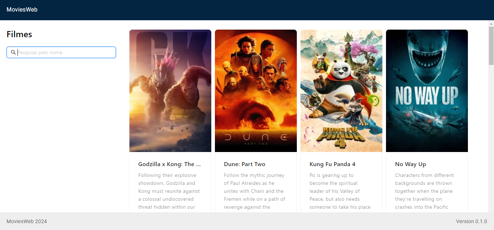
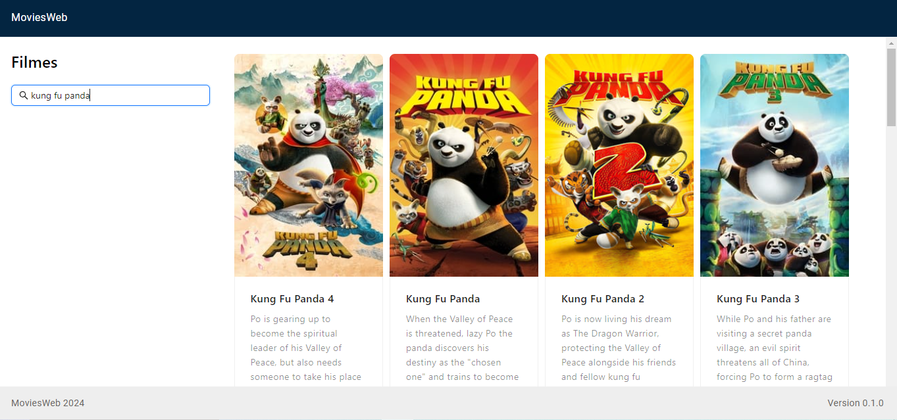
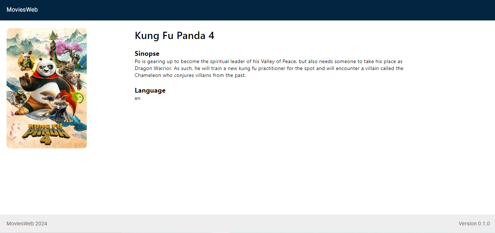

<div align="center">

<p>
 <a href="#-sobre-o-projeto">Sobre</a>
</p>
<p>
 <a href="#-funcionalidades">Funcionalidades</a>
</p>
<p>
 <a href="#-layout">Layout</a>
</p>
<p>
 <a href="#-como-executar-o-projeto">Como executar</a>
</p>
<p>
 <a href="#-tecnologias">Tecnologias</a>
</p>
<p>
 <a href="#-contribuidores">Contribuidores</a>
</p>
<p>
 <a href="#-autor">Autor</a>
</p>

## 💻 Sobre o projeto

MoviesWeb

O <b>MoviesWeb</b> tem como principal objetivo <i>"simular uma experiência similar ao site de filmes"</i> com ele é possivel efetuar buscas com diversos tipos de filmes, agregando com um design super moderno de forma simples e objetiva. Pensado e construído com intuito de agregação de estudos de tecnologia.</p>

---

## ⚙️ Funcionalidades

- [x] Home:

  - [x] Pagina "mostruario" com o principal objetivo de efetuar buscas atravéz do campo de pesquisa.

- [x] Pesquisa:

  - [x] Pagina responsável por trazer resultados da busca e até mesmo efetuar uma nova busca.

- [x] Detalhes:
  - [x] Pagina responsável por visualizar dados do filme selecionado

---

## 🎨 Layout

<p align="center" style="display: flex; align-items: flex-start; justify-content: center;">
  
  
  
</p>

---

## 🚀 Como executar o projeto

Antes de começar, você vai precisar ter instalado em sua máquina as seguintes ferramentas:
[NodeJS](https://nodejs.org/en/). Para ajudar, recomendo um bom editor para trabalhar com o código como [VSCode](https://code.visualstudio.com/)

#### 🎲 Adquira o repositorio do projeto

```bash

# Clone este repositório
$ git clone https://github.com/taniamaraiza/web-movies.git


```

#### 🎲 Configurando

```bash

# Abra o projeto em um editor ou cmd na pasta webmovies
$ cd webmovies

# Instale as dependências do projeto
$ npm install

💡 Certifique-se de estar na raiz do projeto (pasta webmovies) para executar
o comando npm install

```

#### 🎲 Executando a aplicação

```bash

# Rode seguinte comando no terminal
$ npm start


```

<p>✅ Pronto, o app estará rodando no host: (http://localhost:3000/)</p>

---

## 🛠 Tecnologias

As seguintes ferramentas foram usadas na construção do projeto:

#### **WebMovies** ([React](https://reactjs.org/) + [TypeScript](https://www.typescriptlang.org/))

- **[React Router Dom](https://github.com/ReactTraining/react-router/tree/master/packages/react-router-dom)**
- **[React Icons](https://react-icons.github.io/react-icons/)**
- **[Jest](https://jestjs.io/)**
- **[Eslint](https://eslint.org/)**
- **[Prettier](https://prettier.io/)**
- **[GitHub Actions](https://docs.github.com/pt/actions)**
- **[Coveralls](https://coveralls.io/)**
- **[Commitlint](https://commitlint.js.org/#/)**
- **[Styled Components](https://styled-components.com/)**
- **[Husky Lint](https://typicode.github.io/husky/#/)**

> Veja o arquivo [package.json](https://github.com/taniamaraiza/webmovies/blob/main/package.json)

## 👨‍💻 Contribuidores

<table>
  <tr>
    <td align="center"><a href="https://github.com/taniamaraiza"><br /><sub><b>Tania Maraiza</b></sub></a><br /><a href="https://github.com/taniamaraiza" >👨‍🚀</a></td>
  </tr>
</table>

## 💪 Como contribuir para o projeto

1. Faça um **fork** do projeto.
2. Crie uma nova branch com as suas alterações: `git checkout -b my-feature`
3. Salve as alterações e crie uma mensagem de commit contando o que você fez: `git commit -m "feature: My new feature"`
4. Envie as suas alterações: `git push origin my-feature`
   > Caso tenha alguma dúvida confira este [guia de como contribuir no GitHub](https://www.linkedin.com/pulse/como-contribuir-em-um-projeto-open-source-github-f%C3%A1bio-amaral/?originalSubdomain=pt)

---

## 🦸 Autor

Desenvolvedor apaixonado por programação e tecnologias.

<a href="https://github.com/taniamaraiza">
 
 <br />
 <sub><b>Tania Maraiza</b></sub></a> <a href="https://github.com/taniamaraiza" title="GitHub Tania">🚀</a>
 <br />

---
